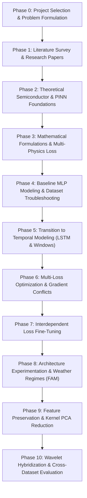

# 📌 Phase 0 — Project Selection & Problem Formulation

> **Phase Focus:** High-level project scoping, domain selection, core problem identification, formal problem statement, and primary technical objectives for building a 12-Month Multi-Physics Informed Neural Network (PINN) Digital Twin for Photovoltaic (PV) power forecasting and predictive health maintenance.

---

## 🎯 1. Proposed Broad Research Area
* **Primary Domains:** Deep Learning, Smart Grid Analytics, Renewable Energy Systems, Physics-Informed Neural Networks (PINNs), and Predictive Health Maintenance.
* **Interdisciplinary Fusion:** Fusing solid-state semiconductor physics (Shockley diode circuit models), non-equilibrium thermodynamics (heat dissipation & convective cooling), and chemical degradation kinetics (Arrhenius thermal stress aging) with temporal deep learning architectures (LSTMs & Wavelet transforms).

---

## 🏷️ 2. Proposed Project Title
**Physics-Guided Deep Learning for Solar Power Forecasting and Prediction-Based Maintenance**

---

## 🔍 3. Comprehensive Problem Identification

Solar energy generation is inherently intermittent and volatile. Solar farms operate in non-stationary environments subject to sudden cloud transients, seasonal micro-climates, and extreme thermal cycling.

### The Modern Solar Analytics Dilemma:
1. **The Pure Data-Driven Black-Box Trap:**
   Standard AI architectures (MLPs, LSTMs, Transformers, XGBoost) learn purely by fitting historical data curves ($y = f(x; \theta)$). 
   * **Failure Mode 1 (Unphysical Outputs):** During sharp weather ramps or nighttime transitions, pure data-driven models generate physically impossible predictions—such as predicting negative power output at night or output exceeding the solar constant ($1361\text{ W/m}^2$).
   * **Failure Mode 2 (Over-Smoothing):** Under volatile cloud cover, standard loss functions ($\text{MSE}$) force black-box models to output average expected values, completely missing sharp peak generation and cloud drop edges.
   * **Failure Mode 3 (Lack of Diagnostics):** A pure machine learning model predicts output power but cannot diagnose *why* power dropped—is it caused by cloud shading or physical panel aging (series resistance growth $R_s$)?

2. **The Numerical Physics Solver Bottleneck:**
   Traditional differential solvers (e.g., SPICE circuit models or finite-element thermal solvers) enforce physical laws with 100% precision. However:
   * They require measuring unobservable internal physical parameters—such as series resistance ($R_s$), shunt resistance ($R_{\text{sh}}$), and diode ideality ($n$)—which cannot be measured by surface pyranometers or weather stations during active operation.
   * Differential equation solvers are computationally slow and cannot execute real-time power grid dispatch or automated predictive maintenance.

3. **Early Dataset Limitations:**
   Early trial datasets were constrained by constant or synthesized weather conditions that lacked real-world meteorological variability, leading models to memorize artificial patterns rather than learning robust physics.

---

## 📝 4. Formal Problem Statement

> **Problem Statement:** Reliable 12-month solar power forecasting and state-of-health asset diagnostics across diverse climatic zones is severely hindered by the scarcity of open-access, high-resolution plant telemetry and the vulnerability of pure black-box neural networks to extreme seasonal weather shifts—such as monsoon cloud transients and summer cell overheating. 

Existing machine learning platforms fail under non-stationary weather drift because they lack structural physical constraints, while traditional physical solvers cannot perform real-time parameter estimation from surface sensor telemetry.

---

## 🚀 5. Core Project Objectives

To bridge the gap between black-box AI and numerical physics solvers, this project achieves five primary technical objectives:

1. **Ingest & Clean Multi-Source Telemetry:** Build pipeline architecture to ingest high-frequency (5-minute to 15-minute) meteorological and electrical telemetry across multiple geographical and technology datasets (`xSi12922.csv`, `mSi0166.csv`, `Eugene_xSi12922.csv`, `first.csv`).
2. **Build a Multi-Physics PINN Digital Twin Engine:** Formulate a 4-component composite objective function unifying:
   * **Empirical Data Loss ($\mathcal{L}_{\text{data}}$):** Supervised empirical target fit.
   * **Single-Diode Circuit Physics ($\mathcal{L}_{\text{sde}}$):** Enforcing Shockley semiconductor energy conversion laws.
   * **Thermodynamic Heat Balance ($\mathcal{L}_{\text{thermal}}$):** Constraining junction cell temperature ($T_{\text{cell}}$) with convective cooling.
   * **12-Month Arrhenius Kinetics ($\mathcal{L}_{\text{aging}}$):** Modeling cumulative thermal stress degradation ($R_s(t)$ growth).
3. **Solve the Timescale Mismatch:** Resolve the conflict between fast 5-minute weather ramps and slow 12-month degradation kinetics by implementing a **Decoupled 12-Month Macro Cumulative Riemann Integral** training strategy.
4. **Physics-Preserving Feature Reduction & Hybridization:** Apply Kernel PCA (RBF kernel) to compress collinear background features without destroying core physical units, and integrate Discrete Wavelet Transform (DWT `'db4'`) de-noising with an analytical Single-Diode circuit solver directly inside the forward pass.
5. **Cross-Asset Generalization & Zero-Shot Transfer:** Benchmark model robustness across monocrystalline and multicrystalline silicon assets, validating zero-shot transfer performance on unseen commercial installations ($R^2 > 0.90$).

---

## 🗺️ 6. Overall Project Execution Roadmap

