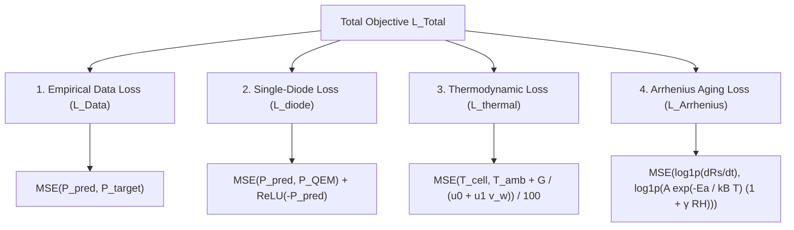

# 📐 Phase 3 — Research & Mathematical Formulations (Multi-Physics PINN Engine)

> **Phase Focus:** Formal mathematical formulation of the Multi-Physics PINN Engine, derivation of the Quadratic Explicit Model (QEM) for explicit PyTorch backpropagation, and definition of the 4-Component Composite Loss Function.

---

## 📁 Files Included in This Phase Folder
* 🐍 **[`fix_loss_function.py`](fix_loss_function.py):** Physical Cascade model resolving Ghost Coupling, log-space Arrhenius kinetics, and loss scaler explosions.
* 🐍 **[`single_diode_pinn.py`](single_diode_pinn.py):** Full 5-parameter Single-Diode Model PINN benchmark pipeline.

---

## ⚡ 1. Core Physics Integration & Transcendental Bottleneck

The Single-Diode Equation is an **implicit transcendental equation** because current $I$ appears both on the left-hand side and inside the exponential function:

$$I = I_{\text{ph}} - I_0 \left[ \exp\left( \frac{V + I R_s}{n V_t} \right) - 1 \right] - \frac{V + I R_s}{R_{\text{sh}}}$$

In standard numerical physics (e.g. SPICE), solving this requires iterative Newton-Raphson solvers. However, inside a PyTorch automatic differentiation graph ($\text{autograd}$), running iterative loops stalls GPU backpropagation and causes exploding/vanishing gradients.

---

## 🧮 2. The Quadratic Explicit Model (QEM) Formulation

To overcome the implicit transcendental bottleneck, we utilize the **Quadratic Explicit Model (QEM)** via a second-order Taylor expansion around the Maximum Power Point (MPP):

$$I_{\text{MPP}}(V) = \frac{-F_B(V) - \sqrt{F_B(V)^2 - 4 F_A(V) F_C(V)}}{2 F_A(V)}$$

Where $F_A(V), F_B(V), F_C(V)$ are explicit algebraic polynomial functions of voltage $V$, cell temperature $T_{\text{cell}}$, series resistance $R_s$, and solar irradiance $G$.

This allows PyTorch to compute theoretical maximum physical power output in **$\mathcal{O}(1)$ GPU time**:

$$P_{\text{phy}} = I_{\text{MPP}}(V) \cdot V_{\text{MPP}}$$

---

## 🎯 3. The 4-Component Composite Multi-Physics Loss Function

The total objective function regularizing the neural network is defined as:

$$\mathcal{L}_{\text{Total}} = \mathcal{L}_{\text{Data}} + \lambda_1 \mathcal{L}_{\text{diode}} + \lambda_2 \mathcal{L}_{\text{thermal}} + \lambda_3 \mathcal{L}_{\text{Arrhenius}}$$

### Derivation of Loss Components:

#### 1. Empirical Data Loss ($\mathcal{L}_{\text{Data}}$):
Supervises the network predictions against measured target power outputs:

$$\mathcal{L}_{\text{Data}} = \frac{1}{N} \sum_{i=1}^N \left( \hat{P}_i - P_{\text{sim}, i} \right)^2$$

#### 2. Photovoltaic Single-Diode Loss ($\mathcal{L}_{\text{diode}}$):
Enforces semiconductor energy conversion limits via QEM and applies a $\operatorname{ReLU}$ penalty to eliminate negative power predictions at night:

$$\mathcal{L}_{\text{diode}} = \frac{1}{N} \sum_{i=1}^N \left( \hat{P}_i - P_{\text{QEM}}(G_i, \hat{T}_{\text{cell}, i}) \right)^2 + \operatorname{ReLU}(-\hat{P}_i)$$

#### 3. Thermodynamic Heat Balance Loss ($\mathcal{L}_{\text{thermal}}$):
Enforces the First Law of Thermodynamics governing panel surface heating and convective wind cooling:

$$\mathcal{L}_{\text{thermal}} = \frac{1}{N} \sum_{i=1}^N \left( \hat{T}_{\text{cell}, i} - \left[ T_{\text{amb}, i} + \frac{G_i}{u_0 + u_1 \cdot v_{w, i}} \right] \right)^2$$

Where $u_0 = 26.9\text{ W/m}^2\text{K}$ (thermal conduction coefficient), $u_1 = 1.06\text{ W/m}^3\text{s K}$ (wind convection coefficient), and $v_{w, i}$ is ambient wind speed.

#### 4. Arrhenius Degradation / Aging ODE Loss ($\mathcal{L}_{\text{Arrhenius}}$):
Restricts long-term performance drift by modeling kinetic material wear under thermal and humidity stress in log-space:

$$\mathcal{L}_{\text{Arrhenius}} = \frac{1}{N} \sum_{i=1}^N \left( \log(1 + \widehat{dR_s/dt}_i) - \log\left(1 + A \cdot \exp\left(-\frac{E_a}{k_B \cdot \hat{T}_{\text{cell}, i}}\right) \cdot (1 + \gamma_{\text{rh}} \cdot RH_i)\right) \right)^2$$
