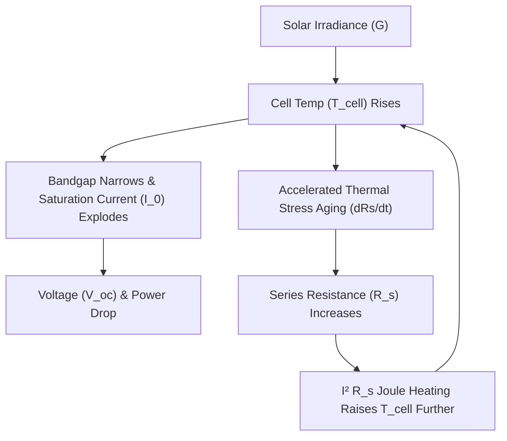

# 🔗 Phase 7 — Loss Function Interdependence & Fine-Tuning Optimization

> **Phase Focus:** Transition from isolated loss evaluations to a tightly coupled Interdependent Multi-Physics Loss Formulation, capturing non-linear feedback loops between junction temperature, series resistance degradation, and Shockley diode dynamics.

---

## 🔬 1. The Concept of Interdependent Loss Formulation

Building upon the decoupled strategy from Phase 6, Phase 7 focused on establishing **mutual variable interdependence** across all four loss functions.

### The Problem With Independent Loss Component Evaluation:
In early trial models, loss terms operated as independent penalty blocks:

$$\mathcal{L}_{\text{total}} = w_1 \mathcal{L}_{\text{Data}} + w_2 \mathcal{L}_{\text{diode}} + w_3 \mathcal{L}_{\text{thermal}} + w_4 \mathcal{L}_{\text{aging}}$$

Where:
* $\mathcal{L}_{\text{thermal}}$ evaluated $T_{\text{cell}}$ independently of current $I$.
* $\mathcal{L}_{\text{aging}}$ evaluated $R_s$ independently of operating diode voltage.

In real solar panels, these variables are **physically coupled in a continuous feedback loop**:

---

## 🛠️ 2. Equation Rearrangement & Interdependent Coupling

We rearranged the underlying physical equations inside the PINN loss engine so that latent variables were explicitly shared across loss computations:

1. **Coupled Temperature-Diode Physics:** Cell temperature estimated by the thermal head ($\hat{T}_{\text{cell}}$) is passed directly into the diode loss ($\mathcal{L}_{\text{diode}}$) to compute thermal voltage $V_t = \frac{k_B \hat{T}_{\text{cell}}}{q}$ and adjust saturation current $I_0(\hat{T}_{\text{cell}})$.
2. **Coupled Aging-Diode Physics:** The estimated degradation rate ($\widehat{dR_s/dt}$) updates series resistance $R_s(t) = R_{s, 0} + \int \widehat{dR_s/dt} \, dt$, which modifies the voltage drop $V + I R_s$ inside the Single-Diode loss penalty.
3. **Coupled Joule Heating:** Series resistance heating $I^2 R_s$ feeds back into the thermal heat balance expected temperature $T_{\text{expected}}$.

---

## 📊 3. Outcome & Stability Performance ($R^2 = 0.79$)

By establishing mutual variable interdependence:
* **Stability:** The network achieved a highly stable, non-oscillating loss convergence curve during backpropagation.
* **Realistic Physical Bounding:** Eliminated edge case instabilities where predicted temperatures drifted while power predictions remained unnaturally high.
* **Performance Benchmark:** Achieved **$R^2 = 0.79$ (79%)** across all multi-season test sequences, establishing a tight, physically consistent baseline before regime specialization.
