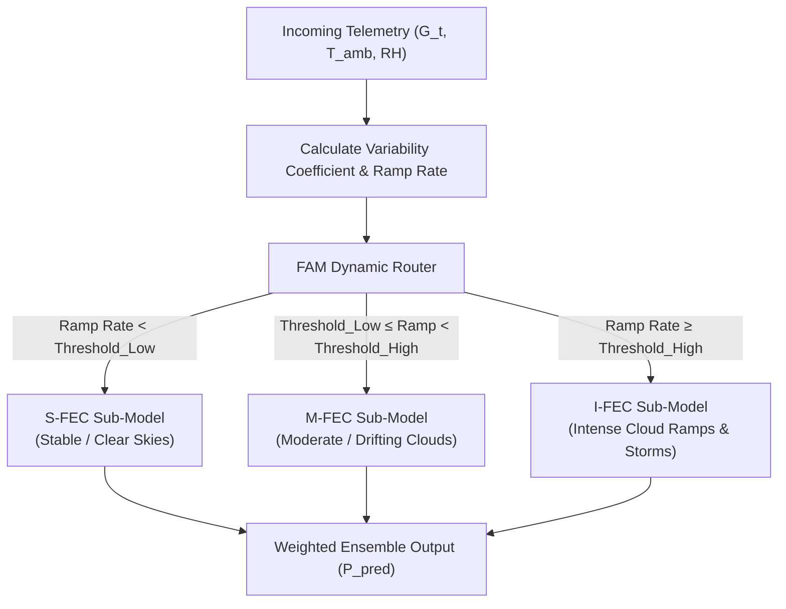

# 🌤️ Phase 8 — Architecture Experimentation & Weather Regime Specialization (FAM)

> **Phase Focus:** Testing Bidirectional LSTMs (Bi-LSTMs) vs. Unidirectional LSTMs, analyzing temporal causality leakage, and implementing the Fluctuation Allocation Mechanism (FAM) for weather regime specialization (S-FEC, M-FEC, I-FEC).

---

## 📁 Files Included in This Phase Folder
* 🐍 **[`study_fam_multiphysics_pinn.py`](study_fam_multiphysics_pinn.py):** Benchmark script implementing the Fluctuation Allocation Mechanism (FAM) ensemble PINN architecture.

---

## 🚫 1. Bidirectional LSTM (Bi-LSTM) Experiment & Failure ($R^2 = 0.76$)

To test whether processing sequence history in both forward and backward time directions would capture deeper context, we tested a **Bidirectional LSTM (Bi-LSTM)** architecture.

```
Forward Pass:  x(t-11) ──> x(t-10) ──> ... ──> x(t0)  (Causal Past)
Backward Pass: x(t-11) <── x(t-10) <── ... <── x(t0)  (Non-Causal Future Leakage)
```

### Why Bi-LSTM Failed:
* **The Arrow of Time:** Solar weather telemetry is strictly unidirectional. Atmospheric conditions at time $t$ affect heat accumulation and cell temperature at time $t + 5\text{ min}$, but future weather at $t + 5\text{ min}$ cannot retroactively alter past cell temperature at $t - 10\text{ min}$.
* **Temporal Leakage:** Bi-LSTM's backward hidden pass introduced artificial future information leakage into current predictions, distorting causal physical learning.
* **Outcome:** Test performance dropped from $0.79$ down to **$0.76$ (76%)**, proving that **unidirectional LSTMs are structurally mandatory** for physical time-series modeling.

---

## ⛈️ 2. Fluctuation Allocation Mechanism (FAM) Integration

Solar weather telemetry contains heterogeneous dynamics: clear-sky days exhibit smooth parabolic curves, whereas stormy days contain rapid cloud ramp spikes.

To prevent a single network from struggling across mixed weather dynamics, we integrated the **Fluctuation Allocation Mechanism (FAM)** from foundational PKINN literature:



### Regime Categorization Criteria:
1. **S-FEC (Stable Fluctuation Evaluation Category):** Clear-sky days with minimal irradiance variability ($\text{CV} < 10\%$).
2. **M-FEC (Moderate Fluctuation Evaluation Category):** Partially cloudy days with drifting cloud cover ($10\% \le \text{CV} < 30\%$).
3. **I-FEC (Intense Fluctuation Evaluation Category):** Severe storm fronts and rapid cumulus cloud ramp events ($\text{CV} \ge 30\%$).

---

## 📊 3. Empirical Benchmark Findings

### Zero-Shot Physics Boosts Under Volatile Weather:
* **Exp 2 (`diode` alone):** Single-Model $0.4338 \rightarrow$ FAM Ensemble **$0.5095$ (+7.57% Boost in Zero-Shot Physics!)**
* **Exp 8 (`diode + thermal`):** Single-Model $0.0655 \rightarrow$ FAM Ensemble **$0.1784$ (+11.29% Boost!)**

### Trade-Off Analysis:
* **Strength:** FAM performed exceptionally well at eliminating negative power outputs and stabilizing predictions during chaotic storm regimes (I-FEC).
* **Limitation:** Partitioning data into sub-networks reduced the effective training sample size for individual clear-sky models, creating a natural noise floor around $R^2 \approx 0.798$ during steady conditions.
