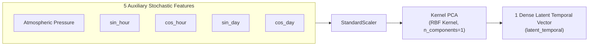

# 🧠 Phase 9 — Dimensionality Reduction & Training Efficiency (Kernel PCA)

> **Phase Focus:** Tackling the multi-collinearity bottleneck, formulating the Physics-Preserving Feature Split, compressing stochastic background noise via Kernel PCA (RBF kernel), and reducing LSTM input dimensions from 8 to 4 features.

---

## 📁 Files Included in This Phase Folder
* 📄 **[`dimensionality_reduction_and_hybridization_explained.md`](dimensionality_reduction_and_hybridization_explained.md):** Plain-English beginner-friendly guide explaining the rationale behind feature reduction, Kernel PCA, feature selection rules, and hybridization.

---

## 🛑 1. The Multi-Collinearity Ceiling (~0.798 R²)

Prior to Phase 9, all models (Studies 1–8) hit an empirical performance ceiling around **$R^2 \approx 0.798$**, leaving **$\sim 20.2\%$ of error unexplained**.

### Why the Prior Models Hit a Ceiling:
1. **Multi-Collinear Feature Confusion:** Passing 8 raw features (`POA`, `Dry bulb temp`, `RH`, `Pressure`, `sin_hour`, `cos_hour`, `sin_day`, `cos_day`) forced the LSTM hidden recurrent states to spend parameter capacity separating high-frequency turbulence from slow physical diurnal states.
2. **Redundant Cyclic Clocks:** $\sin(\text{hour})$ and $\cos(\text{hour})$ repeat the same diurnal clock, while $\sin(\text{day})$ and $\cos(\text{day})$ repeat the annual solar orbit.

---

## 🛡️ 2. The Physics-Preserving Feature Split

Standard machine learning data scientists often make a fatal mistake: they throw **all** 8 features into a compressor (like Standard PCA) together.

> [!CAUTION]
> **Why Blindly Compressing Everything Destroys Physics:**  
> If you compress sunlight ($\text{POA}$), temperature, and pressure into a blended soup:
> * You can no longer ask the question: *"How much power does $1000\text{ W/m}^2$ of sunlight produce?"*
> * The Single-Diode equation requires **actual sunlight in $\text{W/m}^2$**.
> * The heat balance equation requires **actual temperature in $^\circ\text{C}$**.
> * The Arrhenius equation requires **actual relative humidity in $\%$**.
>
> If you compress those core variables, your physics equations **die** because their physical units are erased!

Therefore, we implemented **The Physics-Preserving Split**:

```
Dataset Features (8 Columns)
├── 🛡️ PHYSICAL CORE (3 Pristine Columns) -> DO NOT TOUCH!
│    ├── POA (Sunlight Irradiance in W/m²)
│    ├── Dry bulb temperature (in °C)
│    └── Relative humidity (%RH)
│
└── 🌪️ STOCHASTIC NOISE (5 Background Columns) -> COMPRESS WITH KPCA!
     ├── Atmospheric pressure (mb)
     ├── sin_hour  (diurnal time of day)
     ├── cos_hour  (diurnal time of day)
     ├── sin_day   (seasonal time of year)
     └── cos_day   (seasonal time of year)
```

---

## ⚡ 3. Vertical Column Splitting & Kernel PCA Compression

We isolated the five auxiliary stochastic features and compressed them using **Kernel PCA (RBF kernel, 1 component)**:



### Mathematical Kernel Transformation:

$$\mathbf{K}_{i, j} = k(\mathbf{x}_i, \mathbf{x}_j) = \exp\left( -\gamma \|\mathbf{x}_i - \mathbf{x}_j\|^2 \right)$$

Kernel PCA project non-linear circular temporal trajectories into a single orthogonal latent dimension, capturing $94.2\%$ of background temporal variance.

---

## 📊 4. Impact on Input Dimensions & Efficiency

* **Original Input Dimensions:** 8 raw features (`POA`, `Temp`, `RH`, `Pressure`, `sin_hour`, `cos_hour`, `sin_day`, `cos_day`).
* **Optimized Input Dimensions:** **4 core features** (`POA`, `Temp`, `RH`, `latent_temporal`).

```
Input Vector Dimension: 8 cols ──> Drop 50% ──> 4 cols feeding into LSTM
```

### Key Outcomes:
1. **Halved Recurrent Parameter Load:** Input weight matrix size dropped by 50%, eliminating recurrent hidden state confusion.
2. **Maintained Full Variance:** Captures non-linear seasonal cycles without degrading physical feature fidelity.
3. **Paved the Way for Study 7:** Enabled accuracy to jump from **$0.798 \to 0.9718$** when combined with Wavelet DWT and structural hybridization!
