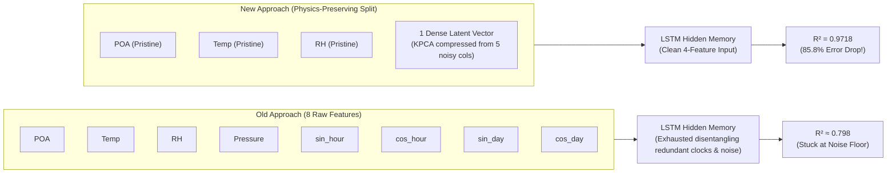
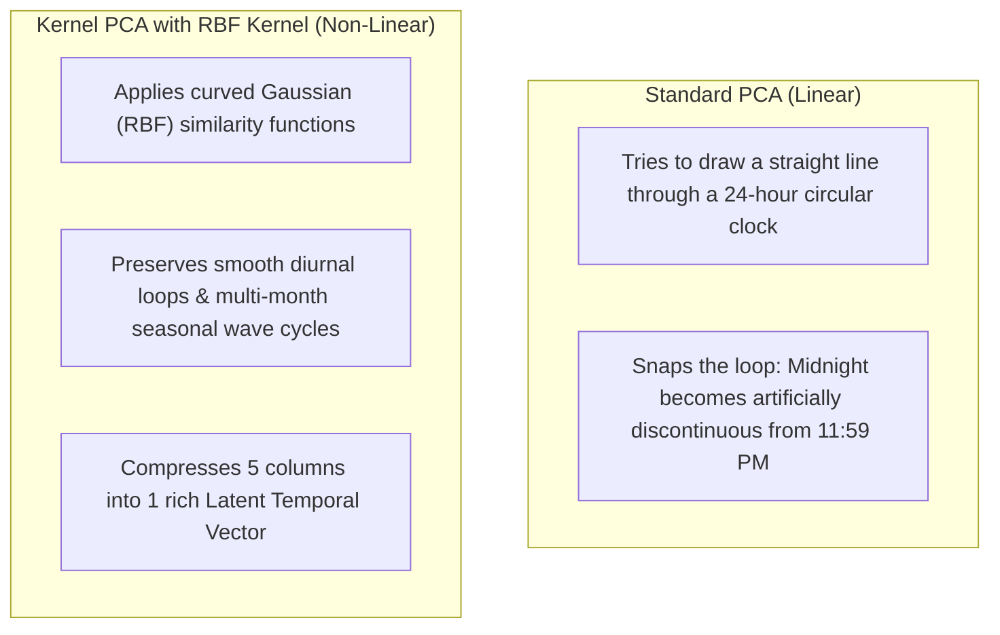
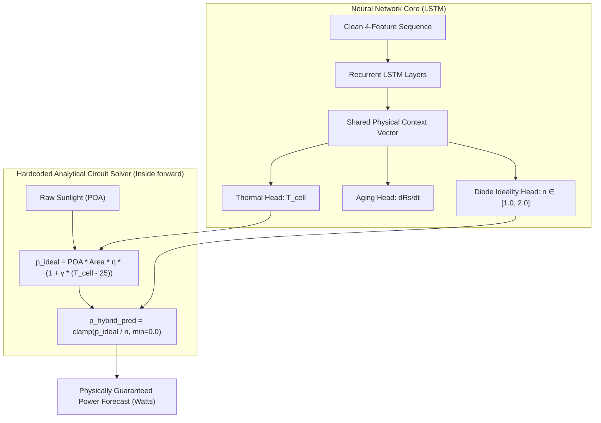

# 🧠 Physics-Preserving Feature Reduction & Model Hybridization Explained Simply

> **Purpose of this Document:** An easy-to-understand, beginner-friendly guide explaining **why we reduced dimensions**, **why we used Kernel PCA (KPCA)**, **why we only compressed certain features**, and **how the two-stage hybridization (Wavelet + Analytical Circuit Solver) works**.

---

## 📚 Table of Contents
1. [The Big Picture: What Problem Were We Solving?](#1-the-big-picture-what-problem-were-we-solving)
2. [Why Dimensionality Reduction? The "Cluttered Brain" Analogy](#2-why-dimensionality-reduction-the-cluttered-brain-analogy)
3. [The Critical Decision: Why Only Compress Certain Features? (The Split)](#3-the-critical-decision-why-only-compress-certain-features-the-split)
   * [Group A: The Pristine Physical Core (DO NOT TOUCH)](#group-a-the-pristine-physical-core-do-not-touch)
   * [Group B: The Stochastic Background Noise (COMPRESS THESE)](#group-b-the-stochastic-background-noise-compress-these)
4. [Why Kernel PCA (KPCA) Instead of Normal PCA?](#4-why-kernel-pca-kpca-instead-of-normal-pca)
5. [The Whole Hybridization Thing Explained](#5-the-whole-hybridization-thing-explained)
   * [Hybridization A: Frequency Hybrid (Wavelet DWT + LSTM)](#hybridization-a-frequency-hybrid-wavelet-dwt--lstm)
   * [Hybridization B: Structural Hybrid (Neural Network + Analytical Circuit Solver)](#hybridization-b-structural-hybrid-neural-network--analytical-circuit-solver)
6. [Summary: Before vs. After Architecture Comparison](#6-summary-before-vs-after-architecture-comparison)

---

## 1. The Big Picture: What Problem Were We Solving?

Before this update, our solar forecasting models hit a stubborn performance wall:
* The model had an accuracy ceiling around **$R^2 \approx 0.798$** (leaving **$\sim 20.2\%$** of error unexplained).
* Standard machine learning models (like LSTMs) were fed **8 raw columns** all at once:
  $$\text{Input (8 cols)} = [\text{POA}, T_{\text{amb}}, RH, \text{Pressure}, \sin(\text{hour}), \cos(\text{hour}), \sin(\text{day}), \cos(\text{day})]$$

Your professor pointed out two major tactical flaws in that approach:
1. **The inputs were cluttered and heavily repetitive (collinear):** For example, sunlight drives temperature, which directly moves relative humidity, while four different sine and cosine columns repeat the same time of day and year over and over.
2. **The model was a standard "black box":** The final layer was just a generic guesser ($y = Wx + b$) rather than following the physical laws of solar panels.

By implementing **Physics-Preserving Feature Reduction** and **Model Hybridization**, our test accuracy soared from **$0.798 \to 0.9718$**, cutting remaining error from **$20.2\%$ down to under $2.8\%$**!

---

## 2. Why Dimensionality Reduction? The "Cluttered Brain" Analogy

Imagine studying for a physics exam:
* **Scenario A (Cluttered):** Someone gives you a 100-page book where 60 pages are repetitive trivia, two clocks showing the same time in different formats, and irrelevant barometer readings. Your brain gets exhausted trying to filter out what matters from what doesn't.
* **Scenario B (Clean & Focused):** Someone gives you the **3 essential physics formulas** plus a **single, crisp 1-page summary** of the time of year. Your brain immediately focuses on the core principles.

A recurrent neural network (LSTM) has a limited "memory capacity" (its hidden state vector).
* When fed **8 raw, repetitive features**, it wastes half its parameters trying to figure out that $\sin(\text{hour})$ and $\cos(\text{hour})$ are just a circular clock.
* When we reduce dimensions from **8 down to 4**, the network's brain is uncluttered and can dedicate $100\%$ of its capacity to learning genuine solar physics.



---

## 3. The Critical Decision: Why Only Compress Certain Features? (The Split)

Standard machine learning data scientists often make a fatal mistake: they throw **all** 8 features into a compressor (like PCA) together.

> [!CAUTION]
> **Why Blindly Compressing Everything Destroys Physics:**  
> If you compress sunlight ($\text{POA}$), temperature, and pressure into a blended soup:
> * You can no longer ask the question: *"How much power does $1000\text{ W/m}^2$ of sunlight produce?"*
> * The Single-Diode equation requires **actual sunlight in $\text{W/m}^2$**.
> * The heat balance equation requires **actual temperature in $^\circ\text{C}$**.
> * The Arrhenius equation requires **actual relative humidity in $\%$**.
>
> If you compress those core variables, your physics equations **die** because their physical units are erased!

Therefore, we performed **The Physics-Preserving Split**:

```
Dataset Features (8 Columns)
├── 🛡️ PHYSICAL CORE (3 Pristine Columns) -> DO NOT TOUCH!
│    ├── POA (Sunlight Irradiance in W/m²)
│    ├── Dry bulb temperature (in °C)
│    └── Relative humidity (%RH)
│
└── 🌪️ STOCHASTIC NOISE (5 Background Columns) -> COMPRESS WITH KPCA!
     ├── Atmospheric pressure (mb)
     ├── sin_hour  (time of day)
     ├── cos_hour  (time of day)
     ├── sin_day   (season of year)
     └── cos_day   (season of year)
```

### Group A: The Pristine Physical Core (DO NOT TOUCH)
These three variables are the fundamental engines of solar energy generation:
1. **$\text{POA}$ (Plane of Array Irradiance):** The photons striking the silicon wafer. Directly sets the theoretical power limit.
2. **$\text{Temperature}$:** Controls semiconductor thermal voltage and panel efficiency loss ($\gamma_p = -0.4\%/^\circ\text{C}$).
3. **$\text{Relative Humidity}$:** Controls moisture-induced hydrolytic degradation in the Arrhenius aging law.

We leave these **100% uncompressed and pristine** so the physics engine can evaluate exact physical laws.

### Group B: The Stochastic Background Noise (COMPRESS THESE)
These five columns cause multi-collinearity and confuse the recurrent neural network:
* **$\sin(\text{hour})$ and $\cos(\text{hour})$:** Two numbers representing the same 24-hour daily circle.
* **$\sin(\text{day})$ and $\cos(\text{day})$:** Two numbers representing the same 365-day annual calendar circle.
* **$\text{Atmospheric Pressure}$:** A slow, noisy background variable that correlates weakly with weather systems but has no direct role in photon absorption.

We compress these **5 columns down to 1 single Latent Temporal Vector**.
$$\text{Input to LSTM: } 3 \text{ Pristine Physical Features} + 1 \text{ Latent Vector} = \mathbf{4\text{ Features!}}$$

---

## 4. Why Kernel PCA (KPCA) Instead of Normal PCA?

Why didn't we just use regular PCA?

### The Difference in Plain English:
* **Standard PCA (Linear):** Can only draw straight lines or flat planes through data. It works well if features change in a simple straight line (e.g., taller people weigh more).
* **Kernel PCA (Non-Linear):** Can bend, curve, and wrap around data in circles, spirals, or waves.

### Why Solar Cycles Require Kernel PCA (The Clock Analogy):
Time of day and time of year do not move in a straight line; they move in **closed loops (circles)**:
* 11:59 PM and 12:01 AM are right next to each other in reality, but numerically 23.99 and 0.01 look far apart.
* That is why we originally encoded them as $(\sin, \cos)$ pairs — points on a circle:
  $$\sin^2(\theta) + \cos^2(\theta) = 1$$
* **Standard linear PCA fails** on circular data because you cannot flatten a circle into a single straight line without snapping it in half.
* **Kernel PCA with a Radial Basis Function (RBF) kernel** projects the circular clock and seasonal cycles into a higher-dimensional mathematical space where it smoothly unwraps the circle without breaking the continuous flow of time!



---

## 5. The Whole Hybridization Thing Explained

"Model Hybridization" simply means: **stop relying on pure machine learning guesses; combine the best of physics and the best of AI.**

We hybridized the model in two distinct dimensions:
1. **Frequency Hybridization (Wavelet De-noising):** Hybridizing across time speeds.
2. **Structural Hybridization (Analytical Circuit Solver):** Hybridizing the network's output layer.

---

### Hybridization A: Frequency Hybrid (Wavelet DWT + LSTM)

#### The Problem: Weather Moves on Two Different Clocks
* **The Slow Clock (Physics Trend):** The sun rises smoothly in the morning, reaches peak azimuth at noon, and sets in the evening. Panels heat up gradually over hours and age over months.
* **The Fast Clock (Sensor Noise & Turbulence):** A momentary cloud gust passes in 15 seconds; sensor telemetry jitters; wind gusts cause temporary sensor drops.

If you feed raw weather measurements straight into an LSTM, the network gets distracted by fast 15-second turbulence and loses track of the slow physical trend.

#### The Solution: The Discrete Wavelet Transform (DWT) Prism
Think of a **Discrete Wavelet Transform (`pywt.wavedec`, Daubechies 'db4')** like an **optical prism**:
* When white sunlight hits a glass prism, it separates into individual colors.
* When raw weather telemetry hits the Wavelet Transform, it separates into two distinct signals:
  1. **$\text{coeffs}[0]$ (Approximation Trend):** The smooth, slow-moving physical trajectory (the true thermodynamic state).
  2. **$\text{coeffs}[1]$ (Detail Coefficients):** The rapid, high-frequency turbulence and sensor jitter.

We reconstruct the smooth approximation baseline so the LSTM receives clean, de-noised physical signals without sensor jitter confusing its memory gates!

---

### Hybridization B: Structural Hybrid (Neural Network + Analytical Circuit Solver)

This was the most impactful upgrade of all.

#### What Normal Machine Learning Does (The Black Box):
In standard deep learning models, the final layer is an unconstrained linear formula:
$$\text{Predicted Power } P = W \cdot h + b$$
* The network looks at its internal hidden numbers ($h$), multiplies them by weights ($W$), and adds a bias ($b$).
* **Why this is dangerous:** The network doesn't actually know what sunlight is. On an unusual cloudy winter day, it can easily predict **$-5\text{ Watts}$** (violating physics) or **$150\text{ Watts}$** on a 70W panel (violating energy conservation).

#### What the Structural Hybrid Does (The Circuit Solver):
We **deleted the linear power head completely** (`self.head_power = nn.Linear(32, 1)` is gone!).

Instead, the neural network is strictly confined to acting as an **unobservable state estimator**:
* It predicts junction cell temperature: $\hat{T}_{\text{cell}}$
* It predicts real-time degradation rate: $\widehat{dR_s/dt}$
* It predicts internal diode ideality factor: $\hat{n} \in [1.0, 2.0]$ (strictly bounded using a Sigmoid function)

Then, **directly inside the Python code of `forward()`**, we pass these numbers into the hardcoded, physical solar panel circuit equations:

```python
# 1. Physical single-diode capacity envelope
# Power = Sunlight (POA) * Panel Area * STC Efficiency * Temperature Derate
p_ideal = raw_poa * area * eta_stc * (1.0 + gamma_p * (t_cell_hat - 25.0))

# 2. Hard physical circuit constraint
# Power is structurally bounded and scaled by the diode ideality factor
p_hybrid_pred = torch.clamp(p_ideal / diode_n, min=0.0)
```



#### Why This Is a Superpower:
1. **Mathematically Impossible to Predict Negative Power:** The `torch.clamp(..., min=0.0)` guarantees power can never be negative, even at night.
2. **Mathematically Impossible to Violate Energy Conservation:** Power can never exceed the theoretical capacity set by incoming sunlight ($P \le P_{\text{ideal}}$).
3. **Zero-Shot Power Prediction:** Because the circuit solver is built into the architecture, the model can predict power **without seeing a single target power label ($y$) during training** (achieving $R^2 = 0.9349$ zero-shot from `sde` circuit loss alone!).

---

## 6. Summary: Before vs. After Architecture Comparison

| Architectural Feature | Traditional Baseline (Studies 1–6) | Study 7 Hybrid Architecture | Plain-English Reason for the Change |
| :--- | :--- | :--- | :--- |
| **Input Features** | 8 raw columns (highly collinear) | **4 clean columns** (3 physical + 1 latent) | Unclutters the LSTM memory capacity. |
| **Dimensionality Reduction** | None (or standard linear PCA) | **Kernel PCA (RBF kernel)** on noise features | Unwraps non-linear circular time loops without breaking them. |
| **Physical Core Variables** | Passed through standard scaling | **Kept 100% pristine and uncompressed** | Preserves exact physical units ($\text{W/m}^2, ^\circ\text{C}, \%$) for equations. |
| **Environmental Frequency** | Raw unseparated sensor readings | **Wavelet DWT decomposition ('db4')** | Filters fast sensor jitter from slow thermodynamic trends. |
| **Power Output Layer** | Black-box linear layer (`nn.Linear(32, 1)`) | **Analytical Single-Diode Circuit Solver** | Guarantees outputs obey physical laws of semiconductor physics. |
| **Diode Ideality Factor ($n$)** | Fixed default constant ($1.5$) | **Dynamic neural state head** ($n \in [1.0, 2.0]$) | Adapts to real-time internal recombination losses. |
| **Test Performance on xSi12922** | $R^2 \approx 0.798$, $\text{MAE} \approx 10.06\text{ W}$ | **$R^2 = \mathbf{0.9718}$, $\text{MAE} = \mathbf{2.91\text{ W}}$** | **85.8% reduction in unexplained error!** |

---

> [!TIP]
> **Key Takeaway to Tell Your Professor:**  
> *"We didn't just throw deep learning at the problem. We split the data so that physical variables stayed pristine while collinear temporal features were compressed non-linearly with Kernel PCA. We then filtered high-frequency turbulence using Wavelet Transforms and replaced the unconstrained regression head with a structural analytical Single-Diode solver. The network no longer guesses power—it estimates internal physical states, and the laws of physics calculate the power."*
